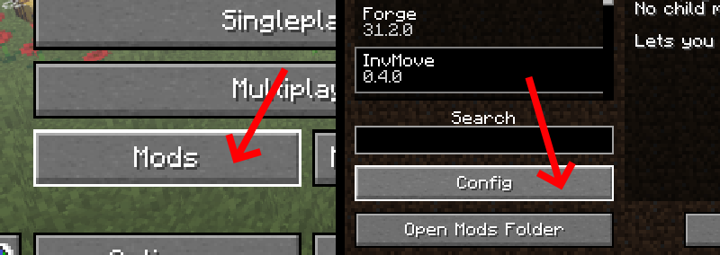
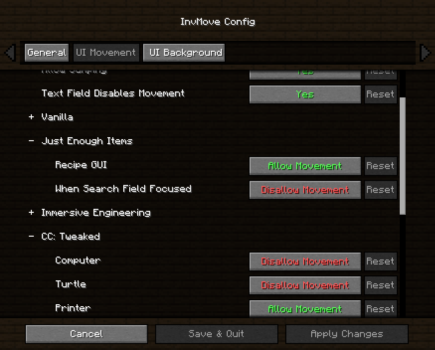

# InvMove
### Minecraft Forge mod that adds the ability to walk around while in inventories

Allows for moving, jumping, sprinting, etc. from within inventories.

Also disables the darkened background in inventories that don't pause the game.

Both features can be toggled on or off per-inventory in the config menu.

This mod is client-side, but it may raise alarms if used on servers with anticheat. 
I take no responsibility if you get banned or something because you used this on public servers.

Made after [I couldn't find an existing mod for this](https://redd.it/egwe8w).

### [Releases](https://github.com/PieKing1215/InvMove/releases)

Requires [Cloth Config](https://www.curseforge.com/minecraft/mc-mods/cloth-config-forge) so the config screen works.

## Config

  
Click to expand.

  

### InvMove has an ingame config menu which can be accessed from the Forge mod list. 
In the config menu, you can find several options: 
#### General:
- Enable: Enable the entire mod
#### UI Movement:
- Move In Inventories: Enable movement in inventories
- Allow Sneaking: Allow sneaking in inventories (disabled by default because it's distracting when shift-clicking)
- Allow Jumping: Allow jumping in inventories
- Text Field Disables Movement: Disable movement when a text field is focused (like search bars or in an anvil)
- (Expandable categories that let you enable/disable movement for certain inventories)
#### UI Background:
- Hide Inventory Backgrounds: Hides the background tint while in inventories.
- (Expandable categories that let you enable/disable the background for certain inventories)

## Compatibility

  
Click to expand.

  

### As of version 0.4.0, InvMove has actual mod support. 

InvMove has specific support for certain mods, but any GUIs from unrecognized mods are added into the config dynamically and can be manually enabled. 
Unrecognized GUIs will only appear in the config once they have been opened/seen in-game.

Explicitly supported mods have their own sections in the config, and come with tested default settings.

If you find problems with any of the explicitly supported mods, please start a ticket in the [issue tracker](https://github.com/PieKing1215/InvMove/issues). 
If there's a mod you want to be added, also please start a ticket in the [issue tracker](https://github.com/PieKing1215/InvMove/issues), especially if it doesn't work enabling it from the "unrecognized" section of the config.

*(The initial list of supported mods was arbitrarily chosen from a mod pack I'm playing)*

InvMove explicitly supports the following mods:
- [CC: Tweaked](https://www.curseforge.com/minecraft/mc-mods/cc-tweaked)
- [Charm](https://www.curseforge.com/minecraft/mc-mods/charm)
- [Corail Woodcutter](https://www.curseforge.com/minecraft/mc-mods/corail-woodcutter)
- [Create](https://www.curseforge.com/minecraft/mc-mods/create)
- [Curios API](https://www.curseforge.com/minecraft/mc-mods/curios)
- [EmbellishCraft](https://www.curseforge.com/minecraft/mc-mods/embellishcraft)
- [Engineer's Decor](https://www.curseforge.com/minecraft/mc-mods/engineers-decor)
- [Immersive Engineering](https://www.curseforge.com/minecraft/mc-mods/immersive-engineering)
- [Just Enough Items (JEI)](https://www.curseforge.com/minecraft/mc-mods/jei)
- [MrCrayfish's Furniture Mod](https://www.curseforge.com/minecraft/mc-mods/mrcrayfish-furniture-mod)
- [Music Maker Mod](https://www.curseforge.com/minecraft/mc-mods/music-maker-mod)
- [Optifine](https://www.optifine.net/)
- [Quark](https://www.curseforge.com/minecraft/mc-mods/quark)
- [Refined Storage](https://www.curseforge.com/minecraft/mc-mods/refined-storage)

## Usage

Feel free to use in packs if you wish.

Do not download this mod from anywhere other than the InvMove GitHub page or the InvMove Curseforge page. 
This mod may not be reposted to any other third-party websites. 
[#StopModReposts](https://stopmodreposts.org)

Tested on Forge 31.2.0 with MC 1.15.2, on both singleplayer and multiplayer.

The mod is licensed under the [GNU General Public License v3.0](LICENSE.md)
